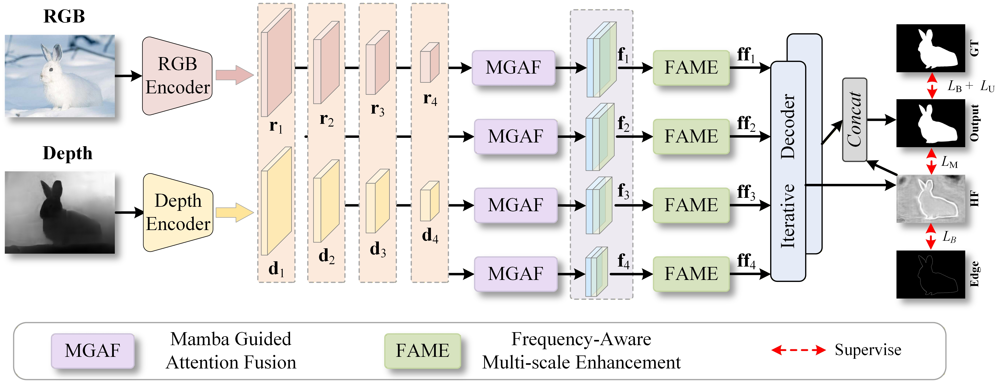

```markdown
<div align="center">

# 🦎 DFMGNet: RGB-D Camouflaged Object Detection With Mamba Fusion and Dynamic Frequency-aware Refinement

<!-- 项目徽章 -->


**[Paper (Under Review)](#)** | **[Baidu Netdisk](#pretrained-models)** 

Official PyTorch implementation of **DFMGNet**. A novel dual-branch architecture for RGB-D Camouflaged Object Detection.

</div>

<br>

## 🚀 Highlights

- 🐍 **MGAF (Mamba-Guided Attention Fusion):** An innovative module for adaptive RGB-D cross-modal interaction.
- 🌊 **FAME (Frequency-Aware Multi-scale Enhancement):** Dynamic high-frequency refinement in the frequency domain.
- 🔄 **Iterative Decoder:** Progressively restores object structures and significantly improves boundary quality.
- 🏆 **Comprehensive Evaluation:** Achieves state-of-the-art performance across major RGB-D COD benchmarks (**CAMO, CHAMELEON, COD10K, NC4K**).

---

## 🖼️ Framework Overview

<p align="center">
  <!-- 请在此处替换为你的网络结构图路径 -->
  
</p>

> **DFMGNet** follows a dual-branch RGB-D pipeline. RGB images and depth maps are first encoded by two PVT backbones, then fused by **MGAF**, refined by **FAME** in the frequency domain, and finally decoded iteratively to generate accurate camouflaged object predictions and auxiliary edge maps.

---

## 📊 Qualitative Results

<p align="center">
  <!-- 请在此处替换为你的可视化结果对比图路径 -->
  
</p>

> Visual comparison of DFMGNet against other state-of-the-art methods. Our model successfully captures accurate object boundaries even in highly challenging camouflaged scenarios.

---

## ⚙️ Setup & Requirements

**Environment:** Python 3.8+ | PyTorch 1.12+ | CUDA-enabled GPU

Install the required dependencies easily via pip:

```bash
pip install torch torchvision numpy opencv-python pillow tqdm tensorboardX einops timm matplotlib onnx termcolor
# Optional for profiling
pip install fvcore thop ptflops
```

---

## 📂 Dataset Preparation

Please organize your datasets as follows. Note that the training set requires `RGB`, `depth`, `GT`, and `Edge` maps, while testing sets only require `RGB`, `depth`, and `GT`.

```text
Data/
└── COD/
    ├── train/           # Contains: RGB/, depth/, GT/, Edge/
    └── test/
        ├── CAMO/        # Contains: RGB/, depth/, GT/
        ├── CHAMELEON/   # Contains: RGB/, depth/, GT/
        ├── COD10K/      # Contains: RGB/, depth/, GT/
        └── NC4K/        # Contains: RGB/, depth/, GT/
```
*💡 **Note:** The current implementation assumes grayscale depth maps and automatically repeats them to 3 channels during loading.*

---

## 📦 Pretrained Models

You can download our code package and pretrained models via Baidu Netdisk:

| Resource | Link | Extraction Code |
| :--- | :--- | :---: |
| 🗂️ **Code & Result Pkg** (`final.zip`) | [Baidu Netdisk](https://pan.baidu.com/s/1gJN_ac6Lnd0KwyqyoTuVLQ?pwd=2025) | `2025` |
| 🧠 **Pretrained Model** (`DFMG_epoch_best.pth`) | [Baidu Netdisk](https://pan.baidu.com/s/165KLBru6dYmhwBZBScvX2g?pwd=2025) | `2025` |

**Placement:**
- Put the pretrained model at: `./checkpoints/ckpt/DFMG_epoch_best.pth`
- Put the PVT backbone weights at: `./pretrain/pvt_v2_b5.pth`

---

## 🏃 Training

Modify dataset and checkpoint paths in `options.py` as needed, then run:

```bash
python train.py \
  --epoch 80 \
  --lr 1e-4 \
  --batchsize 7 \
  --trainsize 384 \
  --load ./pretrain/pvt_v2_b5.pth \
  --rgb_root ../Data/COD/train/RGB/ \
  --depth_root ../Data/COD/train/depth/ \
  --gt_root ../Data/COD/train/GT/ \
  --edge_root ../Data/COD/train/Edge/ \
  --save_path ./checkpoints/ckpt/
```

---

## 🔍 Inference & Evaluation

To generate prediction maps on the benchmark datasets, simply run:

```bash
python test.py --gpu_id 0 --test_path ../Data/COD/test/
```

Prediction maps will be saved sequentially to `./final/COD_result/`.


